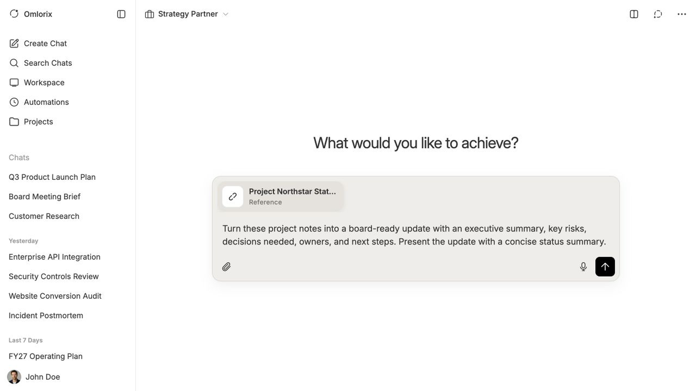
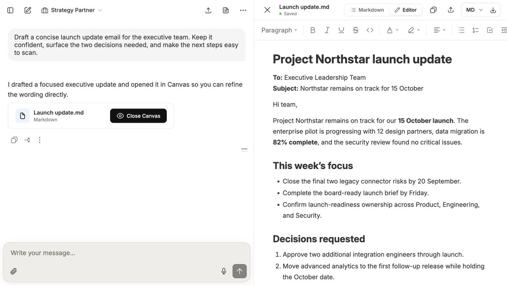
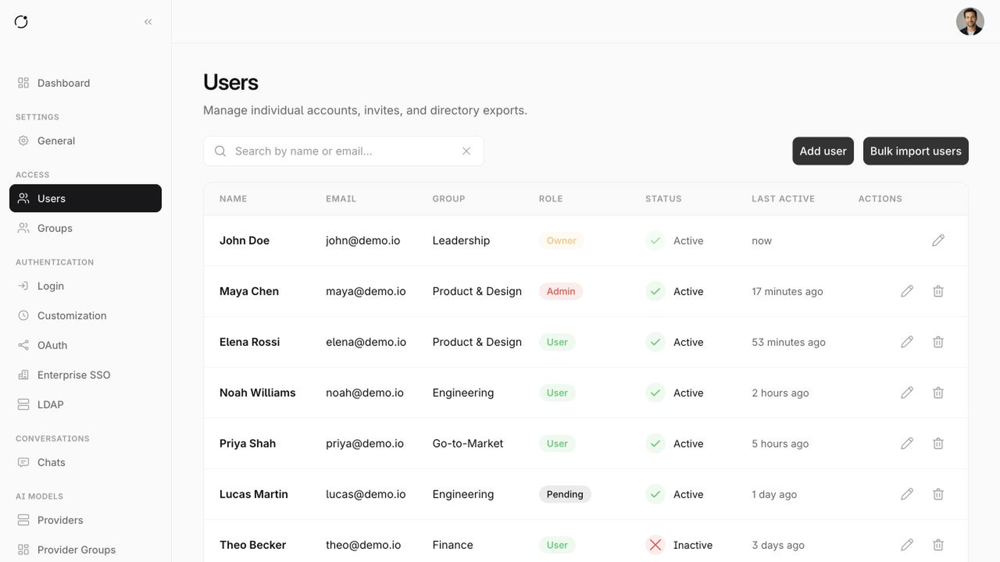

# Omlorix

**A self-hosted, multi-user AI workspace for conversations, knowledge, tools, and collaboration.**

[Operator documentation](documentation/v1.0.0/en/admin/1_start/1_features.md) · [User documentation](documentation/v1.0.0/en/user/1_quick_start/1_start.md) · [Feature catalog](features.md) · [Releases](https://github.com/phinaldoo/omlorix/releases)

Omlorix brings AI chat, files, projects, reusable agents and skills, automations, and administrative controls into one web application. Run it on infrastructure you control and choose which model providers and external services it can use.

> [!CAUTION]
> **Disclaimer:** This software is provided "as is" without any warranties. Use it at your own risk. To the maximum extent permitted by applicable law, the maintainers are not liable for damages resulting from its use.

## No affiliation or endorsement

Omlorix is an independent project. It is not affiliated with, sponsored by, endorsed by, or officially connected with any AI model provider, platform, or third-party service referenced in the repository or application, including OpenAI, Anthropic, Google, Microsoft, GitHub, Mistral AI, ElevenLabs, Exa, and Artificial Analysis.

Third-party product names, logos, brands, and trademarks are the property of their respective owners. References to them identify compatibility or available integrations only and do not imply any partnership, certification, approval, or endorsement. Access to and use of third-party services remains subject to the respective provider's terms and policies.

## Highlights

### AI conversations and content

- Connect multiple cloud or locally hosted model providers and switch between available models.
- Use streaming chat, reasoning controls, file attachments, web search, deep research, and code execution.
- Create images, audio, music, video, slide presentations, visualizations, quizzes, and flashcards.
- Work with realtime voice calls, dictation, read-aloud, meeting transcripts, and split-screen conversations.

### Reusable workspaces

- Organize chats and context in projects alongside files, folders, notes, prompts, todos, bookmarks, and memories.
- Build reusable agents and skills with their own instructions and supporting files.
- Connect MCP servers and third-party services, then use them from chats and agents.
- Schedule automations, receive notifications, trigger workflows through webhooks, and import supported ChatGPT export archives.

### Collaboration and governance

- Support multiple users, managed groups, delegated administration, sharing, and access policies.
- Integrate social login, OAuth/OIDC, SAML, LDAP, passkeys, two-factor authentication, and SCIM provisioning.
- Control provider, model, tool, and feature access with rate limits and group policies.
- Browse and export sanitized audit events, and use statistics, retention controls, and data import/export for day-to-day administration.

### Flexible self-hosting

- Install through the guided Server Launcher, the matching `omlorix-server` CLI, or a Docker Compose source workflow.
- Use bundled services for a straightforward single-server deployment or connect managed infrastructure.
- Store files locally or with S3-compatible storage, Google Cloud Storage, Azure Blob Storage, or WebDAV.
- Add encrypted backups with verified downloads and restore verification.
- Run email, operations, generation, research, file processing, rendering, media, connector ingestion, audit events, account lifecycle, and maintenance in isolated services with durable queues, plus an independently scalable realtime gateway.

Feature availability depends on the providers, services, and policies configured by each administrator.

## Get started

The **Omlorix Server Launcher** is the recommended path for most installations. A command-line workflow is available for headless servers, while a source checkout is intended for development and custom builds.

Follow the installation guide in our documentation to choose the right path and complete setup.

> [!NOTE]
> macOS Server Launcher releases are currently not signed. The release workflow
> still publishes an unsigned macOS build. macOS may report that this build is
> damaged or from an unidentified developer, and automatic Launcher updates may
> not work; users must approve the app manually and install later versions
> themselves.

## License

Omlorix is source-available under the [PolyForm Free Trial License 1.0.0](LICENSE).
You may evaluate it for less than 32 consecutive calendar days for a particular
application. Production use, continued use, and redistribution require separate
permission. Third-party components remain under their respective licenses; see
[THIRD_PARTY_NOTICES.md](THIRD_PARTY_NOTICES.md).
