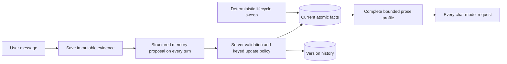

# Adaptive Memory Lab

A standalone, working demonstration of server-owned long-term memory for an LLM chat. It deliberately makes **zero memory tool calls**. The memory model returns a schema-constrained response; deterministic application code validates and applies it.

The demo runs locally without a key using a deterministic simulator. Add an OpenAI API key to `.env` and it uses `gpt-5.6-luna`. There is no embedding model, vector column, vector index, or semantic-retrieval request.

## Research verdict

A single evolving biography is useful, but it is not a safe canonical memory. It loses provenance, makes contradictions hard to resolve, and cannot reliably erase one fact from every historical rewrite. For the intentionally small-to-medium memory in this demo, the simplest strong design is a bounded complete profile backed by atomic facts:

1. Keep the user's messages as source evidence.
2. After every user message, let a small model propose atomic `create`, `update`, `confirm`, or `forget` changes through Structured Outputs—not tools.
3. Apply those proposals in server code to keyed current facts plus append-only version history, timestamps, confidence, sensitivity, and lifecycle policy.
4. Render the concise prose profile the user suggested deterministically from every accepted active fact. This preserves the readable “small text about the user” while preventing an unsupported rewrite from becoming truth.
5. Give the chat model that complete profile on every turn. No search, embeddings, or relevance filter can accidentally omit a fact.
6. Enforce a hard ceiling of 100 active facts per user, then review and hard-delete facts deterministically based on their stability class. Reading a fact never makes it “fresh” again.

This keeps the practical lessons around atomic memory, provenance, updates, and temporal validity from [Mem0](https://arxiv.org/abs/2504.19413), [Zep/Graphiti](https://arxiv.org/html/2501.13956v1), [MemGPT](https://arxiv.org/abs/2310.08560), and [LongMemEval](https://arxiv.org/abs/2410.10813), without importing a retrieval subsystem that a compact profile does not need. Their benchmark-specific results still need validation on representative Omlorix conversations.

## Architecture



The memory model runs unconditionally and receives every current fact—with IDs and verification dates—plus the newest user message. It is explicitly instructed to extract reusable user details even when they appear inside questions or requests, including possessions, devices, vehicles, skills, work, routines, and temporary circumstances. The prose profile is versioned whenever accepted fact revisions change, records the exact fact ID/version pairs from which it was derived, and is injected in full into every chat request. Once a user has 100 active facts, new creations are rejected; updates, confirmations, forgetting, and expiry continue to work. The profile is never truncated and no accepted active fact is silently selected or omitted.

The demo is deliberately smaller than the full production architecture: it keeps a mutable current-fact materialization and an append-only version history, not a complete bitemporal conflict ledger. For Omlorix, fact revisions should be immutable and carry world-valid and transaction-valid intervals, a supersession link, extractor version, and states such as active, disputed, superseded, and archived.

The chat generation and memory proposal run concurrently. The current reply sees the previous committed memory plus the user's newest message; the accepted memory becomes available on the next turn. In a production streaming system, the memory job can move behind an outbox/queue so it never delays the visible response.

### Lifecycle defaults in this demo

| Stability | Freshness half-life | Review after | Hard-delete after |
| --- | ---: | ---: | ---: |
| Stable identity | 540 days | 365 days | 1,095 days |
| Slow-changing | 180 days | 180 days | 540 days |
| Changing context | 45 days | 45 days | 180 days |
| Ephemeral detail | 7 days | 7 days | 30 days |

These are product hypotheses, not universal constants. Only new user evidence, an explicit confirmation, or a manual edit resets the verification clock. Review-aged facts remain visible and eligible with decayed freshness until hard expiry; the UI makes them easy to confirm, edit, or forget. A sweep runs before every chat and should also run on a production schedule. “Simulate time” advances 400 days so review and deletion behavior is visible immediately.

When a fact is forgotten or expires, its current row, version history, and every derived profile snapshot are deleted transactionally. Sanitized lifecycle events keep only an opaque memory ID and category. The original chat message remains part of chat history; deleting chat history is a separate product operation and must be clearly offered in production.

## Why no memory tools

The live path calls `responses.parse(..., text_format=MemoryConsolidation, store=False)`. Structured Outputs constrain the model's response shape, while the server remains the only writer. No `tools` argument is supplied to either model request. See OpenAI's [Structured Outputs guide](https://developers.openai.com/api/docs/guides/structured-outputs).

Server-side defenses in the demo include:

- per-user scoping on every query;
- a literal evidence-substring check plus a value-bearing span that must occur in both the evidence and rendered fact;
- a deterministic predicate signal for canonical name/location slots;
- rejection of credentials, stored instructions, and non-opted-in sensitive facts;
- stable fact keys and explicit target IDs for updates/deletes;
- hard expiry independent of model judgment;
- escaped UI rendering and sanitized audit events;
- `store=False` for Responses API calls.

Those checks establish provenance and basic lexical grounding; they are not proof of semantic entailment. The credential, sensitive-data, and prompt-injection scanners are also defense-in-depth examples, not complete data-loss prevention. A production deployment should add typed predicate/value validation, consent rules per sensitive category, mature secret/DLP detection, quotas, and security evaluation in every supported language.

`store=False` is not the same as contractual zero-data retention. Review OpenAI's current [API data controls](https://developers.openai.com/api/docs/guides/your-data) and configure the organization appropriately before sending production user data.

## Cost model

As of 2026-09-04, OpenAI lists `gpt-5.6-luna` standard short-context pricing at $0.20 per million input tokens, $0.02 cached input, $0.25 cache writes, and $1.20 output. Verify the current [model page](https://developers.openai.com/api/docs/models/gpt-5.6-luna) and [pricing page](https://developers.openai.com/api/docs/pricing) before budgeting.

An illustrative small-profile consolidation with 600 uncached input tokens and 120 output tokens costs about:

```text
(600 × $0.20 + 120 × $1.20) / 1,000,000 = $0.000264 per turn
```

That is roughly $264 per million user turns before chat-generation cost. Consolidation runs after every user message by design; there is no capture mode or skip gate. The UI records actual API token usage and estimates known-model cost per turn.

`gpt-5.6-luna` is the sensible default here: extraction is high-volume and schema-bounded, so a frontier model is usually unnecessary. `gpt-5-nano` is cheaper and worth benchmarking, but should not be adopted without measuring missed updates, false memories, contradictions, and deletion accuracy on representative multilingual conversations.

## Run it

Requires Python 3.11 or newer.

```bash
cd demos/adaptive-memory-demo
python3 -m venv .venv
source .venv/bin/activate
python -m pip install -r requirements.txt
python run.py
```

Open <http://127.0.0.1:8010>.

With the default blank key, `OFFLINE_DEMO_MODE=auto` selects the local simulator. To use OpenAI, edit the already-created `.env`:

```dotenv
OPENAI_API_KEY=your_key_here
OFFLINE_DEMO_MODE=auto
```

Do not commit `.env`; it is ignored by the repository. `.env.example` is the safe template.

Useful settings:

- `OPENAI_MAX_RETRIES=2` retries transient provider failures with the SDK's bounded backoff; `OPENAI_TIMEOUT_SECONDS=60` bounds each attempt.
- `MEMORY_ALLOW_SENSITIVE=false` rejects model-labelled sensitive facts by default.
- `MEMORY_MAX_OUTPUT_TOKENS=2400` gives the structured extractor room to return up to 24 atomic candidates from information-dense messages.
- `MEMORY_MAX_FACTS=100` sets the hard per-user active-fact ceiling and cannot be configured above 100. New facts are rejected at capacity, while existing facts remain updateable. Each fact is limited to 320 characters, so the complete untruncated profile has a deterministic worst-case size of about 32,200 characters.
- `OPENAI_MEMORY_MODEL` and `OPENAI_CHAT_MODEL` are independently configurable to supported Luna, Terra, or Sol model IDs (including dated snapshots).
- `OFFLINE_DEMO_MODE=true` forces simulation even when a key exists.

The no-key simulator is intentionally deterministic: all translated built-in scenarios work, common name/location statements and forget requests work across the 11 UI languages, and a richer set of English examples is recognized. It is for exploring the architecture, not a replacement for multilingual model extraction.

The API exposes `/api/state`, `/api/chat`, `POST /api/conversations` for a fresh chat, manual edit/confirm/forget endpoints, `/api/lifecycle/sweep`, `/api/export`, and `/api/reset`. Starting a new chat preserves the user's long-term memory and previous conversation; resetting the demo deletes both. The export includes messages, current facts, version history, prose snapshots, sanitized events, and usage. The storage schema contains no vector data.

## Verify it

```bash
python -m pip install -r requirements-dev.txt
ruff check .
python -m py_compile run.py memory_demo/*.py
pytest
```

## Production path for Omlorix scale

This is intentionally an isolated, single-user SQLite demo—not a million-user storage design. A production implementation should use PostgreSQL, tenant/user-sharded jobs, an idempotent transactional outbox, bounded workers, per-user sequence ordering, and the same transactional 100-active-fact quota per user. Keep the complete profile as a stable, cache-friendly prompt prefix. If users regularly hit the ceiling, improve consolidation and product-visible archival instead of adding opaque search by default. Enforce ownership/RLS, encrypt sensitive data, expose per-fact and whole-memory controls, and instrument corrections, stale-fact use, active-fact count, capacity rejections, consolidation cost, and queue lag.

Before rollout, build a multilingual evaluation set around the five abilities highlighted by LongMemEval: information extraction, multi-session reasoning, temporal reasoning, knowledge updates, and abstention. Include adversarial memory-poisoning cases such as those studied by [MINJA](https://arxiv.org/abs/2503.03704), and verify erasure against applicable retention and privacy requirements such as [GDPR Article 5](https://eur-lex.europa.eu/legal-content/EN/TXT/?uri=CELEX:32016R0679).
