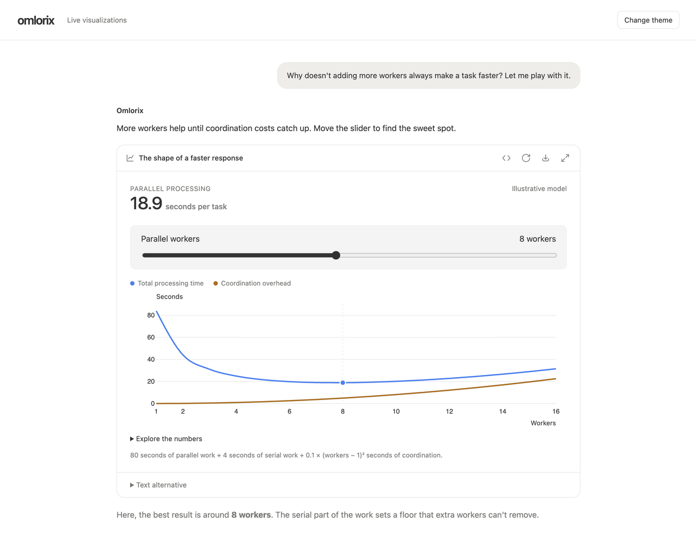
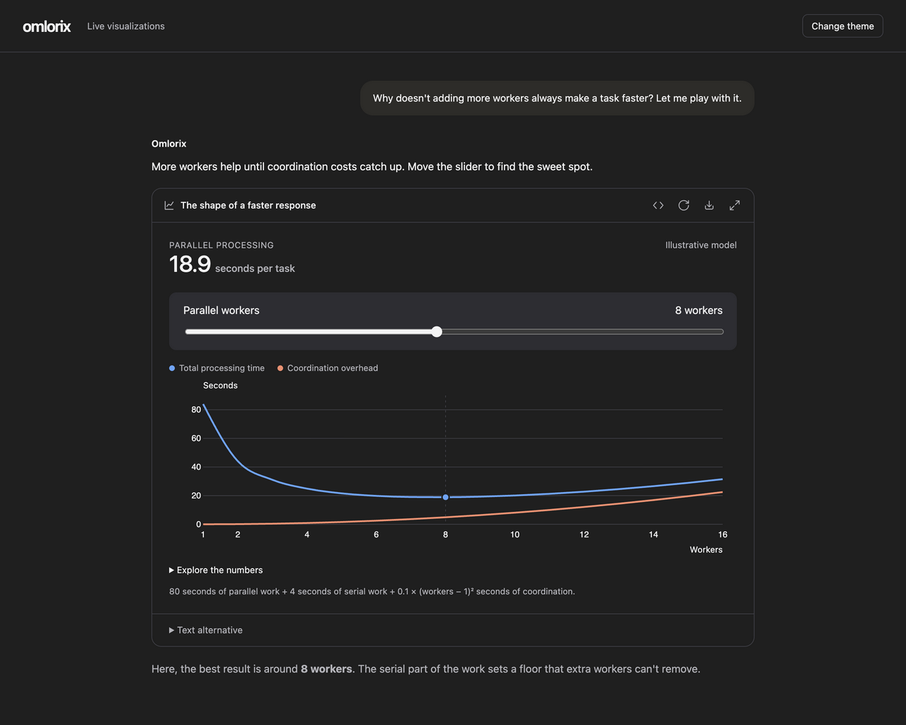
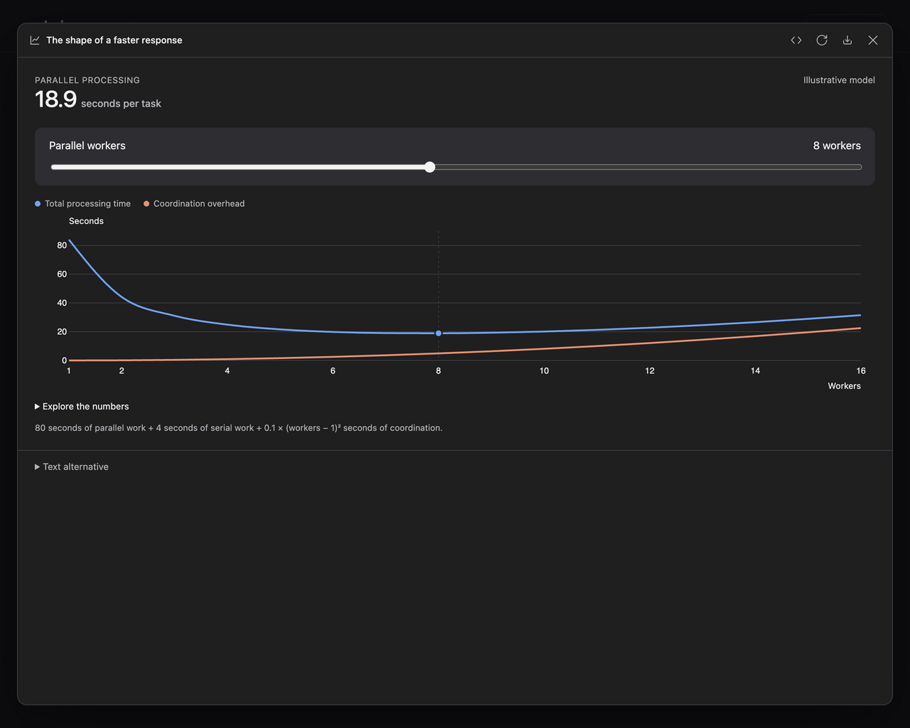
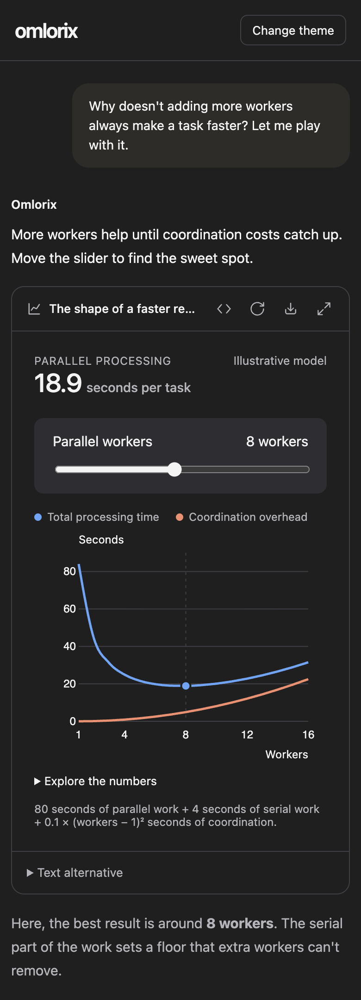

# Live visualization proof

These screenshots show the production Omlorix visualization renderer, local D3
bundle, design tokens, and the real backend proxy document and HTTP security
headers. The conversation around it is an isolated fixture. This does not
require an account, a database, or a live model invocation. The sample is an
explicitly illustrative parallel-processing model, not measured benchmark data.

Captured in the T3 collaborative Chromium browser: desktop at 1280 × 1024 CSS
pixels and narrow layout at 390 × 1080 CSS pixels. All four images were visually
inspected. No generated mockup images or screenshot edits are involved.

| Inline, light | Inline, dark |
| --- | --- |
|  |  |





## Reproduce

From the repository root:

```sh
python3 docs/pr-evidence/live-visualizations/serve.py
```

Open `http://127.0.0.1:8975/?verify`. In the browser console:

```js
await verifyVisualizations()
await verifyVisualizationIsolation()
await proofMount()
// Wait until the surface has data-state="ready", then:
await verifyVisualizationExport()
```

The first check drives real DOM input events through a test-only probe appended
to the fixture. It checks immediate script execution, opaque-origin isolation,
computed result changes, source view, preserved document identity and values
through expansion, inert background/focus restoration, theme synchronization,
overflow, and reset. Host controls were also exercised through browser click
and keyboard tools. Resize and rerun at a narrow viewport.

The isolation check deliberately bypasses model validation and supplies hostile
source to the production renderer. Both its fetch and self-navigation target
loopback test endpoints. The server saw zero requests; parent DOM access was
blocked, and the blocked navigation produced the host's recoverable error UI.

The export check exercises the actual toolbar exporter while suppressing the
browser's download action. Open `http://127.0.0.1:8975/__proof__/export` to inspect
the resulting standalone HTML. Its slider was verified to produce **18.9 s** at
8 workers, with the summary present, all host actions disabled, and zero remote
resource loads. Shared-chat mode was separately checked to remove follow-up and
external-data capabilities while retaining embedded interactivity.

## Validation

- `npm run test:frontend`: 1,327 passed.
- `npm run lint:js` and `npm run lint:python`: passed.
- `pytest backend/tests/tools/test_visualization.py backend/tests/files/test_canvas_html_preview_proxy.py backend/tests/chats/test_widget_blocks.py -q`: 20 passed.
- `python3 dev_scripts/check_translation_keys.py`: all 11 locales match.
- Browser interaction checks: nine assertions passed at desktop and narrow widths.
- Canonical visualization metadata and literal source round-trip through chat blocks.

No live provider generation or Firefox/Safari run was performed. The model's
`validate` action checks structure/policy, not screenshots or JavaScript runtime.
