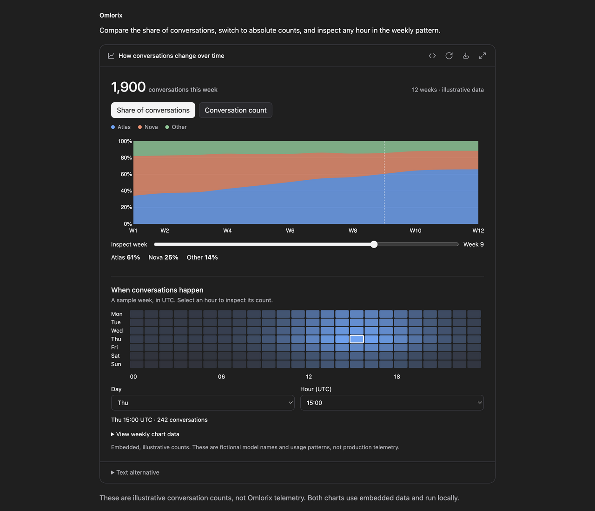
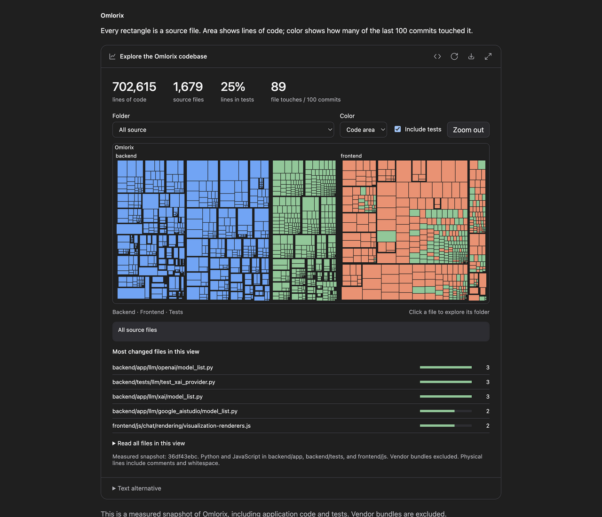
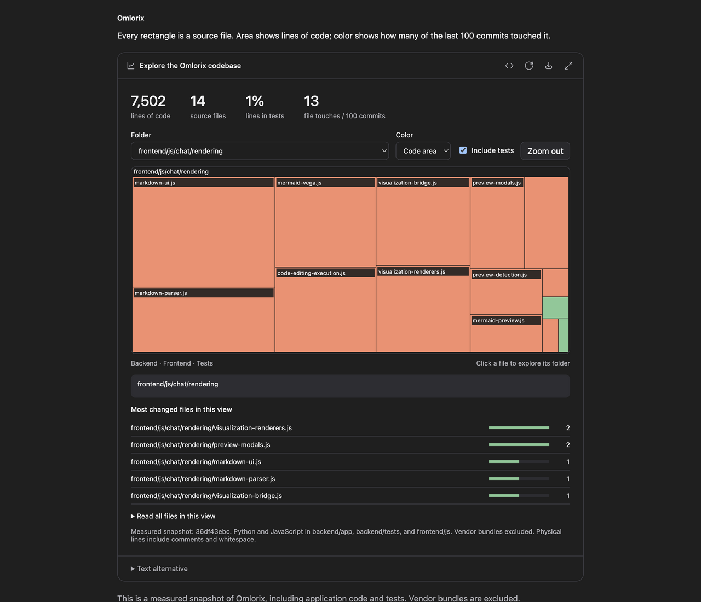
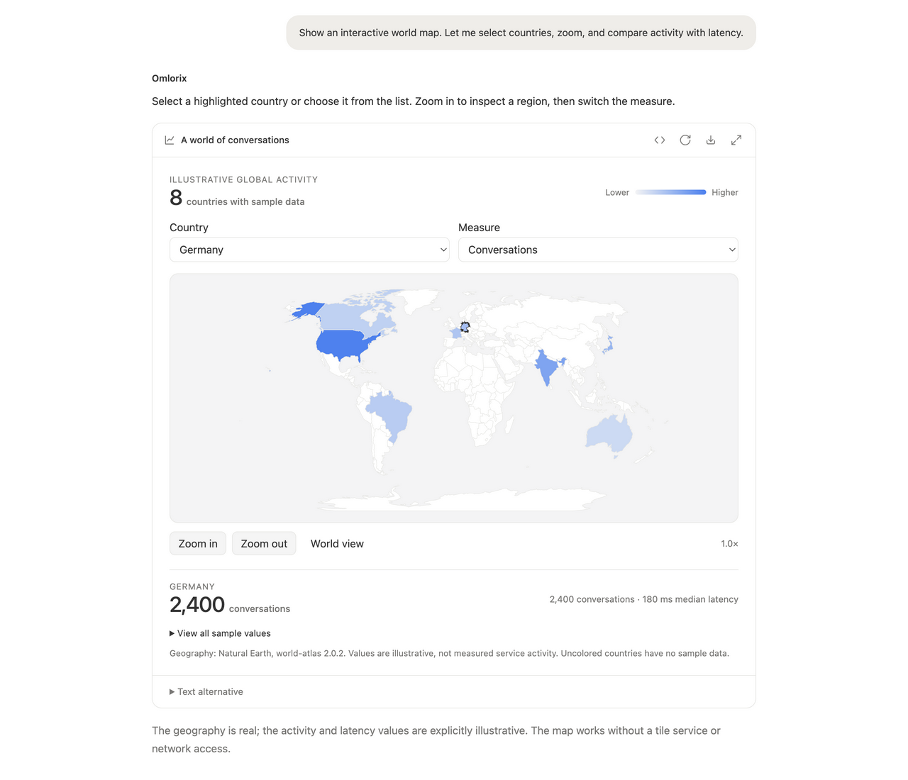
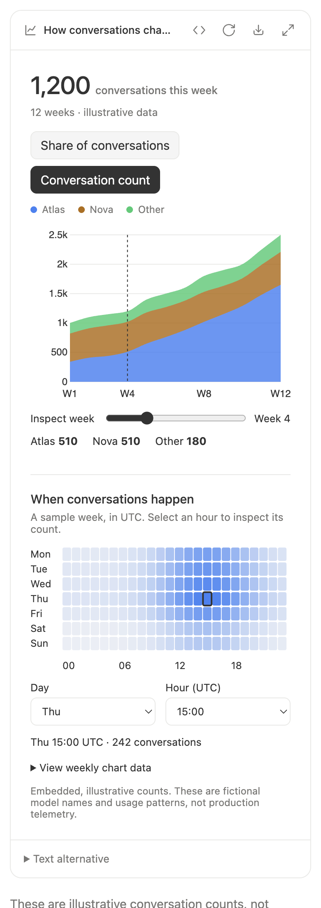
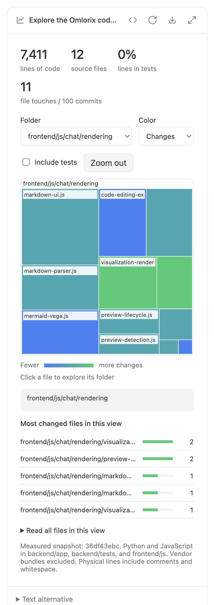
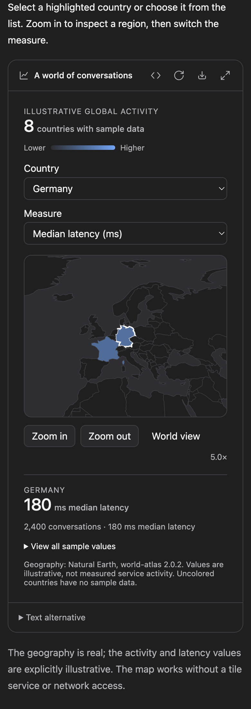

# Live visualization proof

These screenshots show the production Omlorix visualization renderer, local D3
bundle, design tokens, and the real backend proxy document and HTTP security
headers. The conversation around it is an isolated fixture. This does not
require an account, a database, or a live model invocation. The sample is an
explicitly illustrative parallel-processing model, not measured benchmark data.

Captured in the T3 collaborative Chromium browser: desktop at 1280 × 1024 CSS
pixels and narrow layout at 390 × 1080 CSS pixels. All four images were visually
inspected. No generated mockup images or screenshot edits are involved.

| Inline, light | Inline, dark |
| --- | --- |
|  |  |


## Reproduce

From the repository root:

```sh
python3 docs/pr-evidence/live-visualizations/serve.py
```

Open `http://127.0.0.1:8975/?verify`. In the browser console:

```js
await verifyVisualizations()
await verifyVisualizationIsolation()
await proofMount()
// Wait until the surface has data-state="ready", then:
await verifyVisualizationExport()
```

The first check drives real DOM input events through a test-only probe appended
to the fixture. It checks immediate script execution, opaque-origin isolation,
computed result changes, source view, preserved document identity and values
through expansion, inert background/focus restoration, theme synchronization,
overflow, and reset. Host controls were also exercised through browser click
and keyboard tools. Resize and rerun at a narrow viewport.

The isolation check deliberately bypasses model validation and supplies hostile
source to the production renderer. Both its fetch and self-navigation target
loopback test endpoints. The server saw zero requests; parent DOM access was
blocked, and the blocked navigation produced the host's recoverable error UI.

The export check exercises the actual toolbar exporter while suppressing the
browser's download action. Open `http://127.0.0.1:8975/__proof__/export` to inspect
the resulting standalone HTML. Its slider was verified to produce **18.9 s** at
8 workers, with the summary present, all host actions disabled, and zero remote
resource loads. Shared-chat mode was separately checked to remove follow-up and
external-data capabilities while retaining embedded interactivity.

## Validation

- `npm run test:frontend`: 1,327 passed.
- `npm run lint:js` and `npm run lint:python`: passed.
- `pytest backend/tests/tools/test_visualization.py backend/tests/files/test_canvas_html_preview_proxy.py backend/tests/chats/test_widget_blocks.py -q`: 23 passed, including all three launch-example fragments through the actual tool's validate/render dispatcher.
- `python3 dev_scripts/check_translation_keys.py`: all 11 locales match.
- Browser interaction checks: nine assertions passed at desktop and narrow widths.
- Canonical visualization metadata and literal source round-trip through chat blocks.

No live provider generation or Firefox/Safari run was performed. The model's
`validate` action checks structure/policy, not screenshots or JavaScript runtime.

## T3 launch examples: charts, heatmap, code map, and geographic map

The [launch video](https://x.com/theo/status/2107269392874782873) shows a stacked
area chart and weekly activity heatmap (around 1–6 seconds), then a code treemap
with filtering, color modes, file inspection, and folder zoom (around 12–24
seconds). These examples reproduce those interaction types in Omlorix. A
geographic map is included separately to verify geographic mapping as well.

All seven additional screenshots are unedited browser captures of the same
production renderer and backend proxy used above, with the page scrolled to the
visualization. Desktop: 1280 × 1100 CSS pixels. Narrow: 390 × 1100 CSS pixels
(captured at 2×). These are authored tool-input fixtures, not live model output.

### Stacked charts and activity heatmap

Three stacked series can switch between percentage share and absolute counts.
The week slider and heatmap pointer/keyboard selectors update exact values.
The screenshot selects week 9 (1,900 conversations); the narrow view switches
to counts and week 4 (1,200). All counts and model names are illustrative.



### Code treemap

The real Omlorix snapshot contains 1,679 Python/JavaScript files and 702,615
physical lines, including comments and whitespace, at `36df43ebc`. It covers
`backend/app`, `backend/tests`, and `frontend/js`, excluding vendor bundles.
File touches count commits among the last 100; this is not a complexity score.
Run `python3 docs/pr-evidence/live-visualizations/examples/build_code_snapshot.py`
to reproduce the pinned snapshot without changing the checkout.

Canvas renders the dense map. Folder selection, file hit-testing, ranked file
buttons, test filtering, color switching, and zoom-out all work. The narrow
view drills into rendering code with tests removed: 12 files, 7,411 lines.





### Geographic map

The map renders 177 geographic features from embedded Natural Earth geometry
using the bundled D3/TopoJSON libraries. Country selection, keyboard activation,
zoom-in/out, world reset, and metric switching work. Germany's illustrative
values are 2,400 conversations and 180 ms. Zoom is retained during expansion.
No map tiles, CDN libraries, external requests, or additional permissions are
needed for these embedded examples.

The unmodified geometry comes from
[world-atlas 2.0.2](https://cdn.jsdelivr.net/npm/world-atlas@2.0.2/countries-110m.json),
redistributing [Natural Earth](https://www.naturalearthdata.com/about/terms-of-use/).
The accompanying [ISC license](examples/world-atlas.LICENSE) is retained.
The data is a fixture, not an automatic basemap included with every visual.



### Narrow layouts and interaction evidence





With the proof server running, visit each of:

- `http://127.0.0.1:8975/?example=charts&verify`
- `http://127.0.0.1:8975/?example=treemap&verify`
- `http://127.0.0.1:8975/?example=map&verify`

Run `await verifyExample()` in each page's console, starting with the authored
initial state (reload or reset first). This exercises real DOM input, click,
pointer, and keyboard events through a test-only probe in the opaque iframe.
It also checks source view, state-preserving expansion, theme redraws,
overflow, runtime status, absence of remote resource loads, and reset. The
map zoom buttons were additionally tested with the collaborative browser's
actual mouse click and Tab/Enter keyboard input.

**126 assertions passed across 1280, 390, and 320 CSS-pixel widths.** Exact
results are retained in [browser-results.json](examples/browser-results.json).
The toolbar's standalone HTML export was opened and interacted with for all
three examples, with no remote resource loads and all host actions disabled.
Use `await verifyVisualizationExport()` and then open `/__proof__/export` to
repeat that check without writing a download into the user's Downloads folder.
No new runtime permission or network access was added to make these pass.
