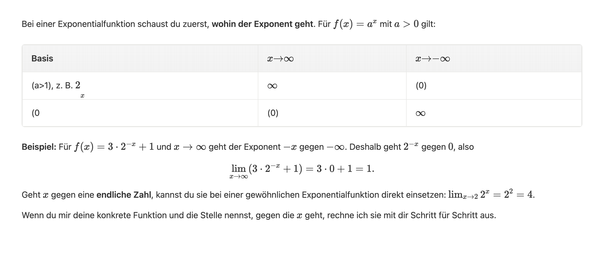
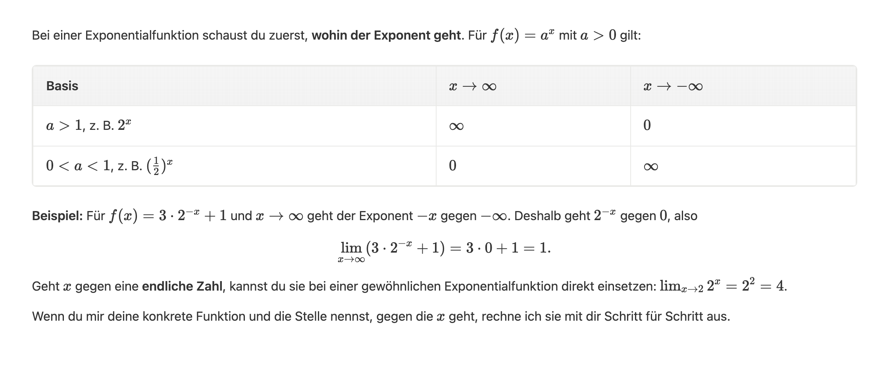

# Markdown/LaTeX table rendering proof

The screenshots use the exact reported assistant response from
[`exponential-limits.md`](../../../frontend/js/chat/rendering/fixtures/exponential-limits.md).
They were captured in headless Chrome at 1120 × 490 CSS pixels (2× scale).
This is an isolated rendering harness using the production Markdown parser,
DOMPurify sanitizer, KaTeX auto-renderer, icons, and styles; it does not require
an authenticated backend or an LLM request.

Before (parser from `2d93fd9c4`):



After:



The browser check asserts all ten table formulas' exact TeX annotations,
three header cells, six body cells, ten accessible MathML formulas, no KaTeX
errors, preserved bold/link/code content, and stable rerendering. Screenshots
were also visually inspected. The baseline capture intentionally skips the
fixed-output assertions.

To reproduce with Chrome and Playwright installed:

```sh
node docs/pr-evidence/markdown-latex-tables/verify.cjs --baseline 2d93fd9c4
node docs/pr-evidence/markdown-latex-tables/verify.cjs
```

Playwright is only needed for this optional proof harness; it is not a new
application dependency. It can be installed in a temporary directory and
resolved using `NODE_PATH`.

Validation: `npm run test:frontend` (1,325 passed), `npm run lint:js`, and the
browser assertions above passed.
